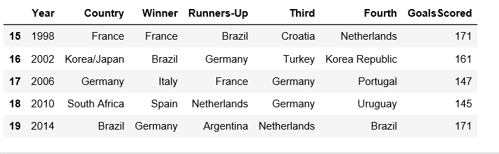
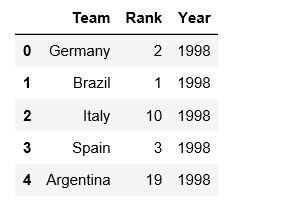
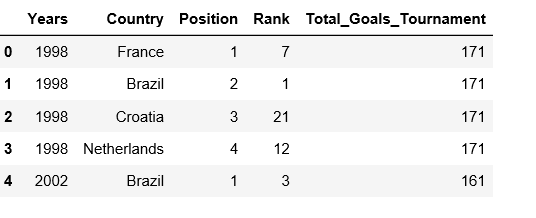
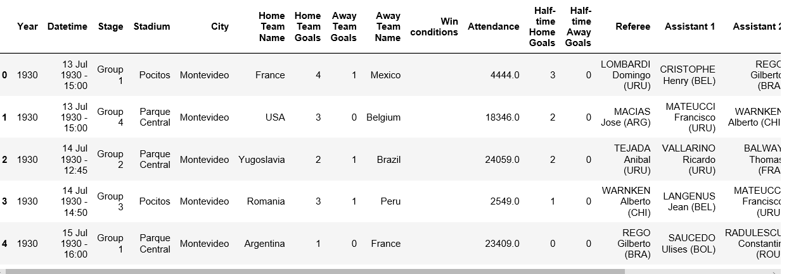
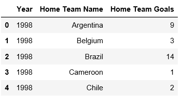
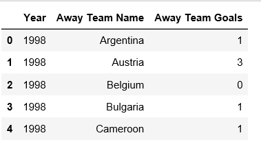
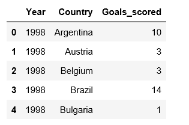
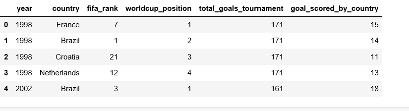

# ETL - FIFA WORLD CUP ,COUNTRY PERFORMANCE AND RANKING
 # TECHNICAL REPORT

## Final files
Final pandas file -  rank_fifa-checkpoint_final_081019.ipynb

Final sql file - worldcup.sql

Final queries file - queries.sql

## INTRODUCTION
ETL is a type of data integration that refers to three steps(extract,transform,load) used to blend data from multiple sources.This process involves extracting data from a source system,converting into a format that can be analysed and stored into a data warehouse.

### DATA SOURCES 
For the ETL project we have used data from two different sources
1.Data.World
2.Kaggel
       link given here  https://www.kaggle.com/abecklas/fifa-world-cup/version/5#
                        https://data.world/jackspades42/worldcuprank/workspace/file?filename=wc_rank.csv#
  
  We got two csv files from kaggle and one csv file from Data.world
  

#### OBJECTIVE
The aim of this project was to compare the performance of the Countries in World Cup to the ranks given to them by FIFA before each tournament.
For this we use three csv files.The name of the files are listed below -
1.WorldcupMatches.csv
2.Worldcups.csv
3.wc_rank.csv

##### DATA CLEANUP AND ANALYSIS

1.WORLD CUP CSV WITH WINNER POSITIONS- The first file is the worldcup csv file used.We extracted the following columns from the csv file -
Year
Country
Winner
Runners-up
Third 
Fourth
GoalsScored

From this file we extracted the latest 5 event from 1998 to 2014.The reason to do this was that the rank file have 5 events from 1998 to 2014.

2.RANK CSV -We used a file which had rank given to ech Country by FIFA.This file was used to extract rank of each country from 1998 to 2014.The rank was then added to the first file with winners position.

3.We made a new table using the above two table.The format of the first table to changed and rank added to it using for loop in pandas.
So we finally got the rank of the top four countries each year.We added a position column and assigned a position  to each team using loop

4.We also wanted to find out the goals scored by each country each year.So we used another csv file .The file has been shown below

The above table had many stages of match each year.Our focus was the semifinal and final match as we had the top four positions.We extracted the data for semi final and final match for year 1998 to 2014.
We extracted the home team goals and away team goals for each team.We grouped the data by year and country 

                          
                                                              

5.The next step was to concatenate the Home team table with Away team table to calculate the total goals of each Country every worldcup.
  The columns were renamed in the concatenated table 
  

6.Finally the goals table was merged with the winner table to get the final data

The above table shows what were the position of the countries in the each World cup vs what  was the FIFA rank given to the teams before the matches.

The above dataframe was connected to postgresql to get the final database

